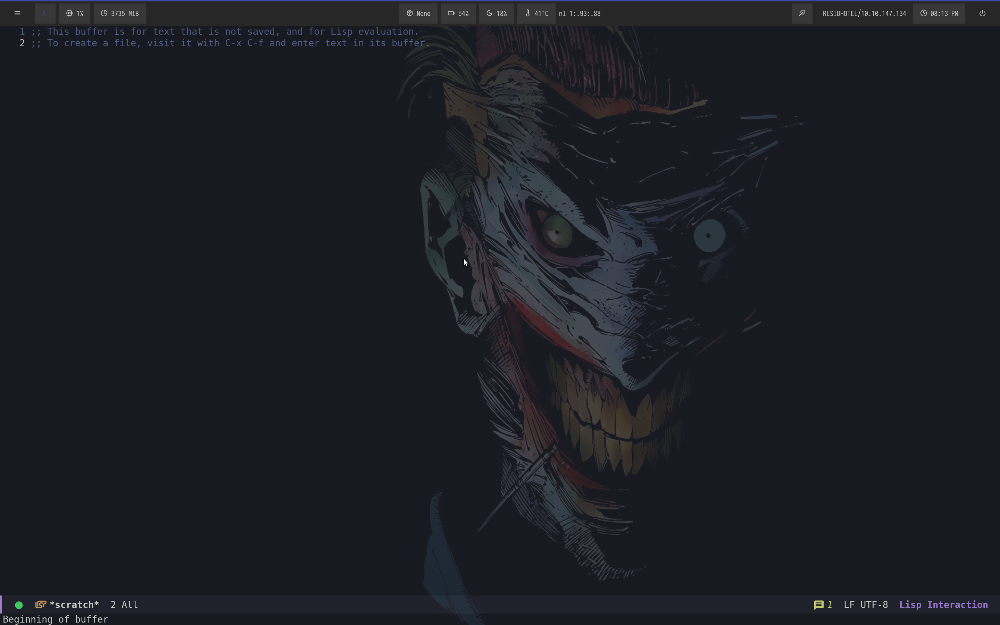
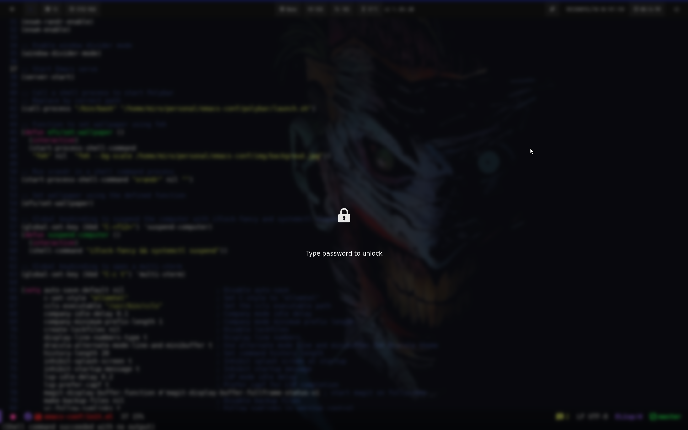
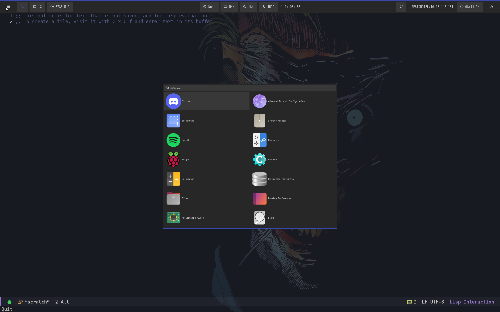

## emacs-exwm configuration

> [!NOTE]
> To use exwm, refer to the exwm-conf branch the master branch is now dedicated only to emacs configuration only

### Don't wait any longer to work with exwm

Exwm is simply awesome, it allows you to increase productivity and learn and take on new challenges  

### Prerequisites

Make sure you have the following prerequisites installed:

1. [**Guix**](https://guix.gnu.org/) - The Guix package manager.
   - [Guix Installation](https://guix.gnu.org/manual/en/guix.html#Binary-Installation)

2. [**Polybar**](https://github.com/polybar/polybar) - The Polybar panel manager.
   - [Polybar Installation](https://github.com/polybar/polybar?tab=readme-ov-file#installation)

### Screenshot

Scratch buffer

Lock screen

Rofi app launcher
